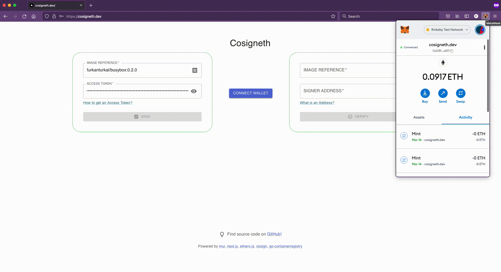
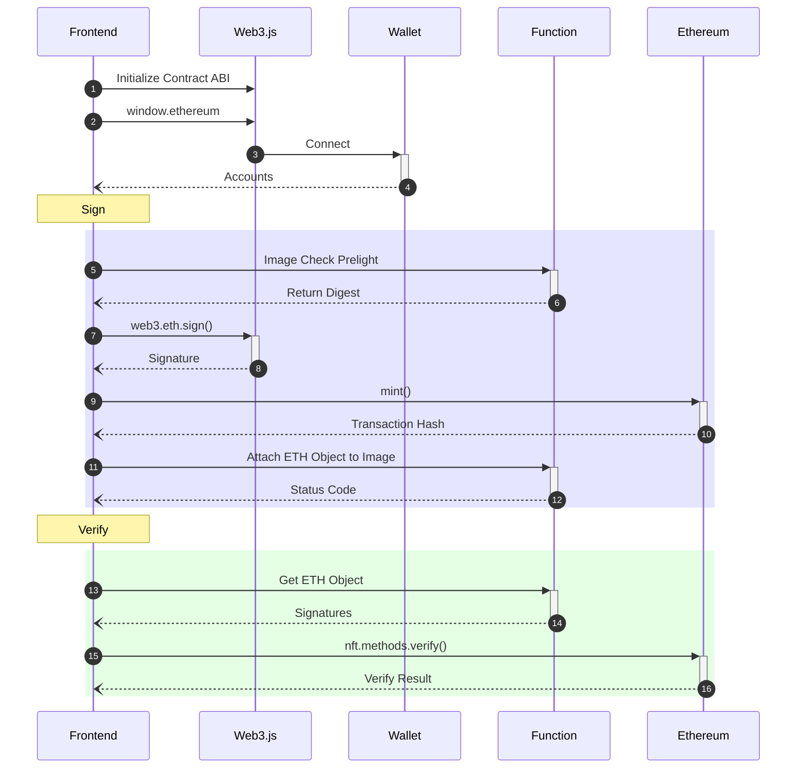

<p align="center"><a href="https://github.com/Dentrax/cosigneth" target="_blank"></a></p>

<h1 align="center"><a href="https://cosigneth.dev">cosigneth</a></h1>

<div align="center">
 <strong>
   An experimental decentralized application for storing and verifying container image signatures as an NFT on Ethereum
 </strong>
</div>

<br />

<p align="center">
  <a href="https://opensource.org/licenses/Apache-2"></a>
  <a href="https://github.com/Dentrax/cosigneth/releases/latest"></a>
  <a href="https://goreportcard.com/report/github.com/Dentrax/cosigneth"></a>
  <a href="https://github.com/Dentrax/cosigneth/actions?workflow=test"></a>
  <a href="https://app.netlify.com/sites/cosigneth/deploys"></a>
</p>

<br />

*[cosigneth](https://cosigneth.dev)*, is a decentralized application that runs on Ethereum Rinkeby Testnet. Each signature stored as an NFT using [EIP-721](https://github.com/ethereum/EIPs/blob/master/EIPS/eip-721.md) standard. Sign your image digest using your public address and verify them on the blockchain by Solidity [contract](https://github.com/Dentrax/cosigneth/blob/main/src/contracts/Cosigneth.sol). Custom [serverless function](https://github.com/Dentrax/cosigneth/tree/main/src/functions) is created to interact with OCI registiries with your given [JWT token](https://docs.docker.com/registry/spec/auth/jwt).
We use [ethers.signMessage()](https://docs.ethers.io/v5/api/signer/#Signer-signMessage) to sign given [image digest](https://github.com/opencontainers/image-spec/blob/main/descriptor.md#digests) using your injected wallet. By giving digest and corresponding signature, we can recover public wallet address by using [ECDSA-tryRecover](https://github.com/OpenZeppelin/openzeppelin-contracts/blob/master/contracts/utils/cryptography/ECDSA.sol) method. See _Appendix F_ in [yellowpaper](https://ethereum.github.io/yellowpaper/paper.pdf) for more information.

[](https://cosigneth.dev)

Active contract: [0x1a0278c2402aa06d88a8d29c0cac8422e983bd55](https://rinkeby.etherscan.io/address/0x1a0278c2402aa06d88a8d29c0cac8422e983bd55#code#L1768)

# How to use

## Prerequisites

* Injected Wallet ([Metamask](https://metamask.io), etc.)
* An Ethereum wallet address
* [Switch network](https://umbria.network/connect/ethereum-testnet-rinkeby) to Rinkeby
* Request 0.1 test ETH from [Chainlink](https://faucets.chain.link) Faucet

## Instructions

### Signing

1. Jump to https://cosigneth.dev
2. Connect your wallet
3. Create a registry token

```bash
$ curl -L -X POST 'https://auth.docker.io/token' \
-H 'Content-Type: application/x-www-form-urlencoded' \
--data-urlencode 'grant_type=password' \
--data-urlencode 'username=$USERNAME' \
--data-urlencode 'password=$PASSWORD' \
--data-urlencode 'service=registry.docker.io' \
--data-urlencode 'client_id=dockerengine' \
--data-urlencode 'access_type=offline' \
--data-urlencode 'scope=repository:$IMAGE:pull,push'
```

> _Replace `$USERNAME`, `$PASSWORD` and `$IMAGE` with yours to [get an access token](https://docs.docker.com/registry/spec/auth/token) from Docker Registry v2 with `300`s expire duration. This is an example for Docker Registry._

4. Pass your OCI _image reference_ and _token (Without Bearer)_
5. Wait until image reference validation and signing process
6. Done! Click the generated [Transaction Hash (Txn)](https://info.etherscan.com/what-is-a-transaction-hash-txhash) on the UI and jump to [Etherscan](https://etherscan.io/)

### Verifying

1. Jump to https://cosigneth.dev
2. Connect your wallet
3. Pass your OCI _image reference_ and _a public wallet address_
4. Wait until fetching signature tags from registry API and verifying process on [EVM](https://ethereum.org/en/developers/docs/evm)
5. Done! Check your verification result on the UI

# How It Works?



# Verify ETH Object

You can use [crane](https://github.com/google/go-containerregistry/tree/main/cmd/crane) to check your `.eth` tag:

```bash
$ crane ls furkanturkal/busybox
0.2.0
sha256-c734ddd2cee195855d0b5b1906afdf84b68940bc736fca03e2d05d2bd228ea9d.eth

$ crane manifest furkanturkal/busybox:sha256-c734ddd2cee195855d0b5b1906afdf84b68940bc736fca03e2d05d2bd228ea9d.eth | jq
```

You should expect the following output:

```json
{
  "schemaVersion": 2,
  "mediaType": "application/vnd.oci.image.manifest.v1+json",
  "config": {
    "mediaType": "application/vnd.oci.image.config.v1+json",
    "size": 233,
    "digest": "sha256:0a151380f4116c9388e53fd6fae56e0769eaf539e6a5e67116a40f37a8e24f20"
  },
  "layers": [
    {
      "mediaType": "application/vnd.dev.cosign.simplesigning.v1+json",
      "size": 252,
      "digest": "sha256:4a9735466ab2e5ddf42968a8e283fc2232b04b8c3a93cb710a934d6307ea220f",
      "annotations": {
        "dev.cosignproject.cosign/blockchain": "Ethereum",
        "dev.cosignproject.cosign/chainId": "4",
        "dev.cosignproject.cosign/network": "rinkeby",
        "dev.cosignproject.cosign/signature": "0x5c4d29575dbb038b12ee2cc49911a8418c243fd404b8c0dfd13e3a24de244c3d7b45e23521a880e6972df76305c662ace2b93006e09865a3e10194cb2bfb30731b",
        "dev.cosignproject.cosign/signer": "0xd8f88dc38071f700ee5003ebfef73266cf16e5f1",
        "dev.cosignproject.cosign/timestamp": "1647261544",
        "dev.cosignproject.cosign/transaction": "0x3f09bbc6ada48c1233bf9f1167c427483234312f8ee907efaa9f91a618aef36f"
      }
    }
  ]
}
```

# Motivation

Because, why not? NFTs are [trend topic](https://trends.google.com/trends/explore?q=nft) nowadays. This idea is a good opportunity to create a decentralized application from scratch. Building a website using Next.js with Material UI was a good experince. We learned to interact with the contract using Web3.js.

# Running on Local

## Web

```bash
$ cd src
$ yarn install
$ yarn dev
```

## Server

```bash
$ cd src/functions
$ go run . -port 8080
```

# Known Issues

* If transaction failed, we attach ETH object anyway. (not actually signed but it will look like that)
* We haven't a resiliency mechanism in case we couldn't talk with Registry API. (actually signed but won't look like that)
* Reverse proxy does not work well on localhost if you want to run local server.

# Tech Stack

## Frontend

* [Next.js](https://github.com/vercel/next.js)
* [Material UI](https://github.com/mui/material-ui)
* [Alchemy Web3](https://github.com/alchemyplatform/alchemy-web3)

## Backend

* [Ethereum](https://github.com/ethereum/go-ethereum)
* [Solidity](https://github.com/ethereum/solidity) + [OpenZeppelin](https://github.com/OpenZeppelin/openzeppelin-contracts)
* [Hardhat](https://github.com/NomicFoundation/hardhat)
* [Go](https://github.com/golang/go)
* [TypeScript](https://github.com/microsoft/TypeScript)
* [cosign](https://github.com/sigstore/cosign)
* [go-containerregistry](https://github.com/google/go-containerregistry)

## Hosting

* [Netlify](https://www.netlify.com)

# License

The base project code is licensed under [Apache License 2.0](https://opensource.org/licenses/Apache-2.0) unless otherwise specified. Please see the **[LICENSE](https://github.com/Dentrax/cosigneth/blob/main/LICENSE)** file for more information.
